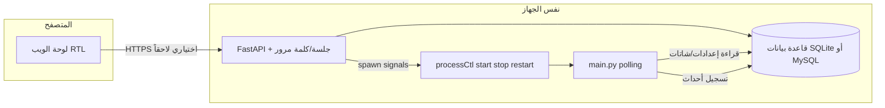

## حالة التنفيذ (محدّث)

### منجز (في المستودع)

| المكوّن | ملاحظات |
|--------|---------|
| **قاعدة البيانات** | [`saherbot_db/models.py`](e:\saherbot\saherbot_db\models.py)، [`database.py`](e:\saherbot\saherbot_db\database.py) (`DB_*` + SQLite افتراضي تحت `data/`)، [`bootstrap.py`](e:\saherbot\saherbot_db\bootstrap.py) |
| **البوت + DB** | [`config_store.py`](e:\saherbot\config_store.py)، [`loader.py`](e:\saherbot\loader.py) (`USE_DASHBOARD_CHATS` + `USE_DASHBOARD_REPLIES`)، [`helpers.py`](e:\saherbot\helpers.py) (`get_list_reply`، `is_monitored_group`، `chat_for_admin_lookup`، `is_admin`)، [`init.py`](e:\saherbot\init.py) (تهيئة DB، إشعار التشغيل من DB، إعدادات طول/صدى لكل شات، تسجيل `events`، `bot.pid`) |
| **لوحة ويب MVP** | [`dashboard/app.py`](e:\saherbot\dashboard\app.py)، [`dashboard/process_control.py`](e:\saherbot\dashboard\process_control.py)، قوالب [`dashboard/templates/`](e:\saherbot\dashboard\templates) تشمل الشاتات، الرسائل/الردود، النسخ الاحتياطي/الاستعادة، وصفحة `/events` |
| **نسخ احتياطي واستعادة** | [`backup_zip_util.py`](e:\saherbot\backup_zip_util.py)، صفحة [`dashboard/templates/backup.html`](e:\saherbot\dashboard\templates\backup.html)، واستدعاء النسخ الاحتياطي قبل إلغاء التثبيت |
| **تشغيل وتثبيت** | [`run_dashboard.py`](e:\saherbot\run_dashboard.py)، [`run.bat`](e:\saherbot\run.bat) و[`run.sh`](e:\saherbot\run.sh) لتبديل اللوحة في الخلفية، `run_dashboard.py start` للأمامي، [`dashboard/process_control.py`](e:\saherbot\dashboard\process_control.py) للتحكم بالبوت من الواجهة، [`install.bat`](e:\saherbot\install.bat)، [`install.sh`](e:\saherbot\install.sh)، [`uninstall.bat`](e:\saherbot\uninstall.bat)، [`uninstall.sh`](e:\saherbot\uninstall.sh)، [`download-and-install.bat`](e:\saherbot\download-and-install.bat) |
| **توثيق/بيئة** | [`requirements.txt`](e:\saherbot\requirements.txt)، [`.env.example`](e:\saherbot\.env.example)، [`.gitignore`](e:\saherbot\.gitignore)، [`DOCUMENTATION.md`](e:\saherbot\DOCUMENTATION.md) |

### متبقٍ اختياري

1. **أمان الواجهة** — CSRF كامل لكل نماذج POST، وإخفاء/تقنيع أقوى للتوكن في أي واجهة مستقبلية.
2. **تشغيل وترقيات** — تحقق PID أدق عبر `psutil` إن توفّر، وAlembic عند الحاجة لترقيات مخطط متعددة.
3. **تحسينات لاحقة** — copy-from عبر API أوسع، فهارس إضافية أو pagination متقدم إذا كبر جدول `events`.

### توثيق وسكربتات التنزيل (قائمة مراجعة — `docs-scripts-sync`)

يجب **تعديل** الملفات التالية لتتوافق مع سياسة التشغيل الحالية (اللوحة أولاً، البوت من الواجهة، `run.bat` / `run.sh` / `run_dashboard.py`، إلغاء التثبيت والنسخ الاحتياطي)، و**حذف الزائد** منها (تكرار خطوات، مسارات قديمة، أو تعليمات متعارضة):

| الملف | المطلوب باختصار |
|--------|------------------|
| [`README.md`](e:\saherbot\README.md) | تحديث قسم التشغيل والتثبيت؛ ربط بـ `install.bat` / `install.sh`، `run.bat` / `run.sh` و`run_dashboard.py`، `uninstall.*`؛ إزالة أي تدفق يتجاهل اللوحة كمسار افتراضي. |
| [`SETUP_WITHOUT_GIT.md`](e:\saherbot\SETUP_WITHOUT_GIT.md) | مواءمة خطوات ZIP مع `download-and-install.bat`؛ توضيح `data/`، اللوحة، ثم البوت من الواجهة؛ إزالة التكرار مع README إن وُجد. |
| [`DOCUMENTATION.md`](e:\saherbot\DOCUMENTATION.md) | مراجعة شاملة للتناسق مع أحدث السلوك (لا تكرار فقرات متعارضة)؛ إبقاء مصدر حقيقة واحد للمسارات الموصى بها. |
| [`run.bat`](e:\saherbot\run.bat) | ويندوز: **تبديل** اللوحة في الخلفية (`run_dashboard.py toggle`). للأمامي: `venv\Scripts\python.exe run_dashboard.py start`. للبوت وحده للمطورين: `venv\Scripts\python.exe main.py`. |
| [`download-saherbot.bat`](e:\saherbot\download-saherbot.bat) | مواءمة الرسائل والروابط مع `download-and-install.bat`؛ حذف أي خطوة زائدة أو مكررة. |
| [`download-saherbot.ps1`](e:\saherbot\download-saherbot.ps1) | نفس منطق النسخة `.bat`؛ توحيد السلوك وتقليل الاختلاف غير الضروري بين السكربتين. |

بعد التنفيذ: وضع علامة **`docs-scripts-sync`** في الـ YAML كـ `completed`.

---

## سياسة التشغيل والتحكم (إلزامية للمشروع)

1. **الداشبورد (خادم FastAPI / uvicorn)**  
   - تشغيل العملية: [`run_dashboard.py`](e:\saherbot\run_dashboard.py)؛ للأمامي: `python run_dashboard.py start` (أو `venv\Scripts\python.exe` / `./venv/bin/python3`)؛ و[`run.bat`](e:\saherbot\run.bat) / لينكس [`run.sh`](e:\saherbot\run.sh) لتبديل الخلفية (تشغيل إن كانت متوقفة، إيقاف إن كانت تعمل).
   - `stop` / `status` لعملية اللوحة نفسها وملف `data/dashboard.pid` يبقيان تحسيناً اختيارياً لاحقاً، منفصلين تماماً عن `data/bot.pid`.
   - **ممنوع** تكديس عشرات الملفات (`run_x.bat`، `start_y.sh`، …) لنفس الغرض؛ أي مسار قديم يُدمج أو يُحذف بعد التوحيد.

2. **البوت (`main.py`)**  
   - **التشغيل والإيقاف وإعادة التشغيل** من **واجهة الداشبورد فقط** (أزرار تستدعي [`dashboard/process_control.py`](e:\saherbot\dashboard\process_control.py)) — هذا هو المسار الموصى به للمستخدم النهائي.  
   - تشغيل `python main.py` يدوياً من الطرفية يبقى **للمطورين فقط** ولا يُعرَّض في التوثيق الرئيسي كمسار متوازٍ مع الداشبورد.

3. **لا سكربت «يشغّل الاثنين معاً»** في الوثائق الرسمية  
   - أي سكربت يفتح نافذتين (بوت + لوحة معاً) **خارج النطاق المستهدف**؛ المسار: تشغيل اللوحة (`run.bat` / `./run.sh` أو `run_dashboard.py start`) → فتح المتصفح → تشغيل البوت من اللوحة.

## السياق الحالي

- عند **`USE_DASHBOARD_CHATS=0`** (الافتراضي): السلوك السابق — `helpers.is_monitored_group()` يعتمد على `loader.MONITORED_CHAT_IDS` من [`.env`](e:\saherbot\loader.py).
- عند **`USE_DASHBOARD_CHATS=1`**: المجموعات المراقَبة تُحدَّد من جدول **`chats`** في قاعدة البيانات (`moderation_enabled=true`) مع تحديث الكاش عند تغيّر **`chats_config_revision`** ([`config_store.py`](e:\saherbot\config_store.py)). إذا لم يُفعّل أي صف، **لا تُشرف** على أي مجموعة (سلوك آمن).
- عند **`USE_DASHBOARD_REPLIES=1`**: ردود القوائم تُقرأ من جدول **`auto_replies`** عبر `get_list_reply` مع ربطها بالشات الحالي، بينما تبقى ملفات `list/` مساراً احتياطياً/انتقالياً عند تعطيل اللوحة.
- إعدادات الطول والصدى الأساسية تُقرأ كقيم فعّالة لكل شات من DB عند تفعيل مسار اللوحة، مع بقاء `.env` كاحتياط للتشغيل التقليدي.

## المعمارية المقترحة

- **عمليتان منفصلتان تقنياً** (البوت `infinity_polling` واللوحة `uvicorn`)، لكن **من منظور المستخدم مسار واحد**: تشغيل/إيقاف اللوحة من **`run.bat`** / **`./run.sh`** (تبديل في الخلفية) أو **`run_dashboard.py start`** (أمامي)، ثم التحكم بالبوت من داخل الواجهة. لا يُوصى بسكربت يفتح نافذتين للبوت واللوحة معاً في التوثيق الرسمي.
- **إدارة عملية البوت من اللوحة (ويندوز ولينكس) — تشغيل / إيقاف / إعادة تشغيل**: اللوحة تتحكم **بعملية البوت على نفس الجهاز** عبر طبقة Python واحدة (مثلاً `dashboard/process_control.py` أو `scripts/bot_ctl.py`) تُستدعى من FastAPI؛ **لا اختلاف في واجهة المستخدم** بين المنصّتين، والفرق يكون داخلياً فقط (`platform.system()` أو فحص `os.name`).
  - **اكتشاف مسار بايثون**: جذر المشروع + `venv\Scripts\python.exe` (ويندوز) أو `venv/bin/python` (لينكس/ماك) — من متغير بيئة اختياري `PROJECT_ROOT` أو `__file__`.
  - **بدء التشغيل**: `subprocess.Popen` مع `cwd` جذر المشروع والوسيط `main.py`؛ بعد ثبات العملية كتابة **PID** في [`data/bot.pid`](e:\saherbot\data\bot.pid) (من `main.py` بعد بدء polling أو من المُشغّل بعد تأخير قصير مع التحقق من أن العملية حية).
  - **الإيقاف**: قراءة PID من `bot.pid`؛ **لينكس/ماك**: `os.kill(pid, signal.SIGTERM)` ثم انتظار حتى `wait`/استعلام حالة (مهلة زمنية ثم `SIGKILL` اختياري إن لزم)؛ **ويندوز**: `taskkill /PID <pid>` (مع `/T` إن وُجدت عمليات فرعية تحتاجها) أو `subprocess` مع نفس المهلة. حذف أو تصفير `bot.pid` بعد التأكد من انتهاء العملية.
  - **إعادة التشغيل**: مسار واحد موحّد **`restart` = إيقاف منظم + انتظار قصير (مثلاً 1–3 ث) + بدء تشغيل`**؛ زر **«إعادة تشغيل»** في الواجهة يستدعي هذا المسار؛ عرض حالة (جاري الإيقاف / جاري التشغيل / فشل) في الواجهة.
  - **التحقق من العملية**: قبل `kill`/`taskkill`، التحقق أن PID لا يزال يشير إلى **نفس المشروع** إن أمكن (قراءة سطر الأوامر عبر `psutil` اختياري أو الاعتماد على PID الذي كتبه البوت فقط مع توثيق المخاطر).
  - **الحالة في الواجهة**: «يعمل / متوقف / جاري…» بناءً على PID و`poll()`؛ تنبيه إذا كان `bot.pid` قديماً والعملية غير موجودة.
  - **حماية**: نفس كلمة مرور اللوحة؛ تأكيد قبل الإيقاف وقبل إعادة التشغيل؛ منع **تشغيل مزدوج** إذا PID لا يزال حياً.
- **قاعدة البيانات**: **افتراضي** ملف [`data/saherbot.db`](e:\saherbot\data\saherbot.db) (**SQLite** + WAL مناسب للتثبيت المحلي)؛ **اختياري** **MySQL** (خادم منفصل أو نفس الجهاز) عبر متغيرات بيئة — انظر القسم التالي.
- **الأمان**: الاستماع على `127.0.0.1` فقط، وكلمة مرور لوحة من `.env` (مثل `DASHBOARD_PASSWORD`) مع جلسة موقّعة (cookie `httpOnly`) أو Basic Auth بسيط؛ **لا تعرض `BOT_TOKEN` في الواجهة** ولا تُسجَّل في `events` أو ملفات اللوج؛ عند التخزين في DB يُفضّل **التشفير** أو الاكتفاء بكتابة `.env` من اللوحة فقط.

## التخزين: SQLite أو MySQL

1. **طبقة موحّدة**: `config_store` (أو حزمة `db/`) تستخدم **SQLAlchemy 2.x** (أو `mysqlclient`/`pymysql` مع طبقة رقيقة) بحيث **البوت واللوحة** يستخدمان **نفس** نماذج الاستعلام؛ لا استعلامات SQL خام خاصة بمحرك واحد إلا مع `text()` المحمي أو اختلافات موثّقة بحد أدنى.
2. **التهيئة من `.env`**: متغيرات `DB_TYPE` و`DB_HOST` و`DB_PORT` و`DB_USERNAME` و`DB_PASSWORD` و`DB_DATABASE` (SQLite افتراضي تحت `data/saherbot.db`؛ أو `postgresql` / `mysql` كما في `saherbot_db/database.py`).
3. **المخطط**: جداول **UTF-8** (`utf8mb4` في MySQL)؛ أنواع **JSON** — في SQLite `TEXT` + `json.loads` أو عمود JSON حسب الإصدار؛ في MySQL `JSON`؛ تجنب ميزات غير المحمولة بين المحركين في الاستعلام الحرّ (مثلاً اعتماد `AUTOINCREMENT`/`SERIAL` المحمول).
4. **الترحيل**: سكربت واحد «إنشاء الجداول إن لم توجد» (`create_all` أو Alembic اختياري) يُشغَّل من البوت أو اللوحة عند أول اتصال؛ توثيق **نسخ احتياطي قبل ترقية المخطط**.
5. **الأداء**: مع MySQL تفعيل **pool صغير** للوحة؛ البوت يفضل **قراءة سريعة** + كاش المراجع كما الخطة لتقليل زمن الاتصال لكل رسالة.
6. **النسخ الاحتياطي**: لـ SQLite يبقى ZIP لملف `.db`؛ لـ MySQL إما **زر يستدعي `mysqldump`** (إن وُجد `mysqldump` في `PATH`) أو توثيق **نسخ خارجي** عبر أدوات المزود — الاستعادة باستيراد SQL أو استبدال قاعدة وفق التوثيق.

## دورة تحميل الإعدادات في البوت (متطلب صريح)

1. **عند إعادة تشغيل عملية البوت** (`main.py` يبدأ من جديد): **إعادة قراءة كاملة** من قاعدة البيانات (SQLite أو MySQL) و`.env` لكل ما يخص التوكن، `primary_chat_id`، القوالب، القوائم، قواعد الإشراف لكل شات، الأوامر، إلخ — أي «لقطة» تُبنى من الصفر عند الـ startup.
2. **عند تفعيل الشات أو تعطيل مراقبته** من اللوحة (`moderation_enabled` وما يعادله): **لا يُشترط إعادة تشغيل البوت** لهذا الجزء — اللوحة ترفع **`chats_config_revision`** (عدد صحيح عام في `global_settings` أو ملف `data/revision.txt` بسيط) عند كل حفظ لتفعيل/تعطيل شات؛ البوت يحتفظ بآخر مراجع رأها وفي **بداية معالجة رسالة من مجموعة** (أو في حلقة خفيفة كل بضع ثوانٍ) يقارن المرجع؛ إن تغيّر يُعاد تحميل **جدول/مجموعة الشاتات المراقبة** وصفوف `chats` ذات الصلة من DB فقط (خفيف).
3. **عند تعديل أي إعدادات أخرى** (توكن، CHAT_ID، قواعد إشراف تفصيلية، قوائم كلمات، قوالب رسائل، بايو، أوامر، طول الرسالة، صدى، …): بعد الحفظ في اللوحة تُعرض **رسالة/بانر ثابت** للمستخدم: **«لن يُطبَّق على البوت إلا بعد إعادة تشغيل البوت»** (مع رابط أو زر يفتح قسم التشغيل إن وُجد). التنفيذ: هذه التعديلات **لا تعتمد على المراجعة السريعة** للشات فقط؛ البوت يقرأها **عند إعادة التشغيل** فقط (أبسط وأقل غموضاً من محاولة إعادة تحميل كل الجداول في الزمن الفعلي).
4. **استثناء اختياري لاحقاً**: إن رغبت لاحقاً بـ«إعادة تحميل القوائم من DB دون إعادة تشغيل» يمكن إضافة مراجعة ثانية للقوائم فقط — خارج النطاق الافتراضي أعلاه لتجنب التعقيد.

## تبديل سلوك “الشاتات المراقبة”

- إضافة متغير بيئة صريح مثل `USE_DASHBOARD_CHATS=1`:
  - عند **0** (افتراضي): السلوك الحالي؛ `MONITORED_CHAT_IDS` من `.env` كما اليوم.
  - عند **1**: تجاهل قائمة `.env` للمراقبة واستخدام جدول الشاتات في **قاعدة البيانات**: الشات **مفعّل للمراقبة** فقط إذا كان الصف موجوداً و`moderation_enabled=1` (ويمكن إضافة عمود `paused` إن رغبت بفصل «في القائمة» عن «التعديل شغال»).
- عند `USE_DASHBOARD_CHATS=1` وقائمة الشاتات المفعّلة **فارغة**: تعريف واضح في الوثائق — إما عدم تعديل أي مجموعة (آمن) أو رفض التشغيل؛ الأفضل **عدم تعديل أي مجموعة** حتى تضيف شاتاً من اللوحة (تجنب حظر غير مقصود لكل المجموعات).
- **التهجير**: عند أول تشغيل مع `USE_DASHBOARD_CHATS=1` و DB فارغة، يمكن زر “استيراد من .env” أو استيراد تلقائي لـ `MONITORED_CHAT_IDS` + `CHAT_ID` كصفوف أولية.

## مخطط البيانات (مختصر)

- **`global_settings`**: **`primary_chat_id`** (ما يعادل `CHAT_ID`)، **`notify_on_startup`** (بديل `NOTIFY_RUN`)، **`default_msg_max_length`** و**`default_msg_length_unlimited`**، **`bot_token`** أو سياسة المزامنة مع `.env`، **`chats_config_revision`** (عدد صحيح يُزاد **فقط** عند حفظ **تفعيل/تعطيل مراقبة شات** `moderation_enabled`؛ البوت يقارنه لإعادة تحميل مجموعة الشاتات من DB دون إعادة تشغيل)، وحقول **وصف البوت** وافتراضيات الإشراف والأوامر كما في الأقسام الأخرى.
- **`chats`**: `chat_id` (PK), `title`, `moderation_enabled`, **`msg_max_length`** (عدد صحيح عند تفعيل الحد)، **`msg_length_unlimited`** (boolean؛ عند true يُتخطّى فحص الطول لغير المشرفين في هذا الشات)، **`echo_enabled`** (boolean لنظام الصدى مثل `ECHO_COMMAND` **لكل محادثة**)، و**`moderation_rules`** (JSON أو أعمدة) — الوراثة من `global_settings` عند ترك الحقول «افتراضية» للشات:
  - **`block_links`** (نصوص تحتوي روابط/أنماط `t.me` وغيرها كما `text_has_link_substring`).
  - **`block_phone_numbers`** (أنماط الجوال/الدولي كما `_PHONE_RE`).
  - **`block_telegram_usernames`** (`@username` بعد استبعاد البريد كما الحالي).
  - **`block_entity_links_mentions`** (كيانات تيليجرام: `url`, `text_link`, `mention`, `text_mention` كما `message_entities_restricted`).
  - **`exempt_admins_from_moderation`**: إن **true**، لا يُطبَّق حذف/تحذير الإشراف أعلاه على **مشرفي المجموعة** في هذا الشات (يُوسّع السلوك الحالي الذي يستثني المشرفين من بعض المسارات فقط؛ يُوثّق أن الحظر التلقائي بالضربات لا يمس المشرفين كما هو).
  - يمكن إضافة **`block_documents_stickers`** أو الاعتماد على `allowed_types_json` الموجود لتقليل التكرار.
- **نسخ الخيارات**: توسيع `POST .../copy-from/{source}` ليشمل **`moderation_rules`**، **`msg_max_length` / `msg_length_unlimited`**, **`echo_enabled`**, **صفوف `auto_replies` الخاصة بالشات (نسخ قائمة الكلمات)**، (والأوامر لكل شات إن وُجدت) بالإضافة إلى القوالب النصية؛ أو مسار API منفصل **`POST /api/chats/{target}/lists/copy-from/{source}`** ينسخ فقط قوائم الكلمات لتقليل الخطأ.
- **`events`**: سجل موحّد يغذّي **الإحصائيات** و**سجل كل محادثة**. أعمدة مقترحة: `id`, `ts`, `chat_id`, `event_type`, `meta_json` (مثلاً `user_id`, `username` أو عرض مختصر، `trigger` لرد القائمة، `reason`/`subtype` — **بدون تخزين نص الرسالة الكامل** افتراضياً لتقليل المخاطر والحجم؛ يمكن لاحقاً إضافة علم `LOG_MESSAGE_SNIPPETS=1` ومقتطف قصير إن طلبت).
  - أنواع الأحداث: `delete_length`, `delete_bad_type`, `delete_forbidden_share`, `ban_strikes`, `list_reply`, `join_service_deleted`, `bot_added_banned`, ويمكن إضافة `command_used` (`/id`, `/reload`, …) لتتبع إداري اختياري.
  - **فهرس** `(chat_id, ts DESC)` لتصفح سريع لسجل محادثة واحدة مع **ترقيم صفحات** (cursor أو offset محدود).
- **`message_templates`** (أو حقول نصية في `global_settings` + تجاوزات اختيارية في `chats`): مفاتيح ثابتة للرسائل التي يكتبها البوت اليوم في [`helpers.py`](e:\saherbot\helpers.py) / [`init.py`](e:\saherbot\init.py) كنص عربي ثابت، مثل:
  - تحذير **طول الرسالة**، **نوع المحتوى غير المسموح**، **مشاركة محظورة** (روابط/أرقام/مستخدمين)، **لاحقة التحذير قبل الطرد** (`MODERATION_KICK_WARNING_SUFFIX`)، **إشعار الحظر بعد الضربات**، ورسالة **التشغيل** (`welcome_message` / NOTIFY).
  - لكل مفتاح: نص افتراضي عام + اختيارياً **تجاوز لكل شات** (نفس منطق وراثة الإعدادات).
- **`auto_replies`** — **نظام القوائم (كلمات → رد)** لكل محادثة، يعادل سلوك مجلد [`list/`](e:\saherbot\list) الحالي في [`helpers.get_list`](e:\saherbot\helpers.py): إذا **طابقت رسالة العضو نص المحفّز** (مطابقة غير حساسة لحالة الأحرف كالسلوك الحالي)، يُرد بـ **نص** أو **صورة**.
  - أعمدة مقترحة: `id`, **`chat_id`** (إلزامي أو nullable حيث null = **قائمة عامة** تُستخدم كاحتياط عند عدم وجود تطابق في قائمة الشات نفسه)، **`trigger`** (الكلمة/المفتاح؛ فريد ضمن نفس `chat_id` أو ضمن نطاق «عام»)، **`response_type`** (`text` | `photo`)، **`response_text`** أو **`photo_path`** (مسار نسبي آمن تحت `list/` أو `data/uploads/`)، **`enabled`**, **`sort_order`** (عند تعارض تداخل لاحقاً).
  - **ترتيب البحث في البوت**: (1) مطابقة في قوائم **`chat_id` الحالي**؛ (2) إن لم يوجد، مطابقة في **القائمة العامة** (`chat_id IS NULL`) إن فُعّل ذلك؛ (3) إن لم يُفعّل لوحة القوائم، الرجوع لملفات `list/` كما اليوم.
  - عند التشغيل: دمج القراءة مع **`helpers.load_lists`** — إما **استبدال كامل** عند تفعيل `USE_DASHBOARD_REPLIES=1` أو **دمج** مع الملفات (يُوثّق؛ الأبسط للتهجير: استيراد أولي من `list/` إلى صفوف `auto_replies` مرتبطة بالشات أو كعامة).
- **`command_settings`**: إما JSON داخل `global_settings` + تجاوز في `chats`، أو جدول منفصل — لكل نطاق (عام / شات): تفعيل أو تعطيل أوامر البوت الحالية: **`/id`**, **`/reload`**, **`/ping`**, **`/help`** (وما يُضاف لاحقاً). المعالجات في [`init.py`](e:\saherbot\init.py) تتحقق من الصلاحية ثم من **الأمر المفعّل** قبل التنفيذ؛ يمكن جعل `/id` و`/reload` للمشرفين فقط كما اليوم مع إمكانية تعطيل الأمر بالكامل من اللوحة.

## توكن البوت و CHAT_ID والطول والإشعار والصدى (لوحة + بوت)

1. **`BOT_TOKEN`**: صفحة «الربط» في اللوحة — حقل إدخال **مقنع** (لا يُعرض التوكن كاملاً بعد الحفظ؛ يُظهر آخر 4 أحرف أو «••••» فقط). **التخزين**: إما **مزامنة إلى `.env`** عند الحفظ (البوت يقرأ كما اليوم من `decouple`)، أو عمود مشفّر في SQLite بمفتاح من `.env` مثل `DASHBOARD_SECRET`/`FERNET_KEY` — يُوثّق أن **تغيير التوكن يتطلب إعادة تشغيل البوت** لإعادة إنشاء `TeleBot`.
2. **`CHAT_ID` الأساسي**: حقل **`primary_chat_id`** في `global_settings` يطابق سلوك `CHAT_ID` الحالي (إشعار التشغيل، `chat_for_admin_lookup` في الخاص، إلخ) مع إمكانية التعديل من اللوحة ومزامنة `.env` اختيارية.
3. **حد طول الرسالة**: كما في `global_settings` + `chats` — **رقم** (`msg_max_length`) أو **وضع مفتوح** (`msg_length_unlimited` / الافتراضي العام `default_msg_length_unlimited`). في [`init.py`](e:\saherbot\init.py): إذا غير محدود **للمحادثة**، لا يستدعي فرع حذف الطول لغير المشرفين.
4. **إشعار عند التشغيل**: **`notify_on_startup`** في `global_settings` يعادل `NOTIFY_RUN`؛ عند `true` وبدء polling يُرسل `welcome_message` إلى **`primary_chat_id`** (نص الرسالة من القوالب إن وُجد).
5. **نظام الصدى لكل شات**: **`echo_enabled`** لكل `chat_id`؛ في مسار النص بعد عدم تطابق القائمة، يُنفَّذ الصدى فقط إذا كانت القيمة الفعّالة لهذا الشات `true` (يستبدل الاعتماد على `ECHO_COMMAND` الموحّد من `.env` عند تفعيل لوحة الإعدادات).

## خيارات الإشراف لكل محادثة (لوحة + بوت)

1. **واجهة**: في صفحة الشات قسم «قواعد الإشراف» بتبديلات واضحة (روابط، أرقام، أسماء مستخدمين، كيانات روابط/منشن، …) + **`استثناء الإدارة`**.
2. **منطق البوت**: تقسيم `message_has_forbidden_sharing` / مسار الحذف في `init.py` إلى فحوصات شرطية تعتمد على `get_effective_moderation_rules(chat_id)` (دمج افتراضي عام + شات).
3. **نسخ من شات آخر**: تضمين `moderation_rules` و`command_settings` و**`msg_max_length` / `msg_length_unlimited`** و**`echo_enabled`** و**نسخ قوائم `auto_replies`** (أو استدعاء نقطة نسخ قوائم منفصلة) عند النسخ.

## أوامر البوت ووصف البوت «البايو» (لوحة + بوت)

1. **الأوامر**: صفحة أو تبويب «الأوامر» — مفاتيح لكل أمر؛ دعم **افتراضي عام** و**تجاوز لكل شات** إن رغبت بسلوك مختلف بين المجموعات (اختياري؛ إن تعقّد التنفيذ يبدأ بعالم عام فقط ثم يُوسَّع).
2. **وصف البوت (Telegram Bot API)**: تخزين في `global_settings` لحقول مثل **`bot_description`** (وصف يظهر في المحادثة مع البوت) واختيارياً **`bot_short_description`** (الوصف القصير في الملف الشخصي؛ حدود طول تيليجرام يجب احترامها في الواجهة والتحقق من الخادم).
3. **متى يُطبَّق**: عند **بدء تشغيل عملية البوت** (`startBot` / بعد إنشاء `TeleBot`) استدعاء `set_my_description` / `set_my_short_description` إذا كانت القيم غير فارغة ومفعّل `USE_DASHBOARD` (أو دائماً عند وجود قيم في DB).
4. **قيود تيليجرام مهمة**: الوصف **واحد لكل توكن البوت** على مستوى تيليجرام — **لا يمكن بايو مختلف لكل مجموعة**. إن احتاج المستخدم رسالة ترحيب **داخل كل مجموعة**، ذلك يبقى عبر قوالب الرسائل/الأحداث وليس عبر وصف البوت.
5. **تحديث من اللوحة دون إعادة تشغيل**: زر «تطبيق الوصف الآن» يستدعي نفس دوال API (يتطلب أن تكون اللوحة قادرة على قراءة `BOT_TOKEN` من البيئة بأمان داخلياً فقط — لا تعرض في الواجهة).

## نظام القوائم لكل محادثة (لوحة + بوت)

1. **المعنى**: لكل **محادثة** قائمة من عناصر **(كلمة مُحفّزة → محتوى الرد)**؛ عند إرسال عضو لنص يطابق المحفّز (بنفس منطق التطابق الحالي مع أسماء ملفات `list/`) يرد البوت بالنص أو بالصورة المخزّنة.
2. **اللوحة**: تبويب **«القوائم»** داخل صفحة الشات — جدول (المحفّز، نوع الرد، معاينة/تحميل صورة، تفعيل)، أزرار **إضافة**، **تعديل**، **حذف**؛ اختياري **استيراد من مجلد `list/`** (تقسيم الملفات إلى صفوف مرتبطة بذلك الشات أو كقائمة عامة).
3. **نسخ من شات آخر**: زر «نسخ القائمة من شات…» يستنسخ كل صفوف `auto_replies` حيث `chat_id = المصدر` إلى `chat_id = الهدف` (مع تجنب تكرار `trigger` أو سياسة استبدال يُوثّقها التنفيذ).
4. **البوت**: دالة مثل `get_list_reply(message)` تجمع المحفّزات للشات ثم العامة وتُرجع نفس الشكل الذي يتوقعه المعالج الحالي (نص / مسار صورة)؛ تسجيل `list_reply` في `events` عند الرد.

## التحكم بالردود والرسائل (لوحة + بوت)

1. **صفحة «الرسائل»** (قوالب التحذيرات والتنبيهات): جدول قابل للتعديل للمفاتيح المعروفة + معاينة، حفظ في SQLite وكاش قصير في البوت.
2. **نظام القوائم**: كما في القسم **«نظام القوائم لكل محادثة»** — لا يُخلط في الواجهة بين «قوالب الرسائل» و«قائمة الكلمات للرد».
3. **في البوت**: استبدال السلاسل الثابتة في `delete_with_mention` والحظر و`welcome_message` بـ `get_template`؛ واستبدال `helpers.get_list` بـ **`get_list_reply`** وقراءة **`auto_replies`** مع الرجوع لـ `list/` عند التعطيل أو كطبقة احتياط.

## سجل لكل محادثة (لوحة + بوت)

1. **المصدر**: نفس جدول **`events`** مفلتر بـ `chat_id` — لا حاجة لجدول منفصل ما دام كل حدث يربط المحادثة.
2. **في اللوحة**: من صفحة **تفاصيل الشات** تبويب أو قسم **«السجل»**: جدول زمني (التاريخ/الوقت، نوع الحدث، وصف قصير من `meta_json`، معرف المستخدم عند الحاجة)، مع **تصفية حسب نوع الحدث** و**تحميل المزيد** (pagination).
3. **في البوت**: عند كل إجراء يظهر للمستخدمين في المجموعة (حذف، حظر، رد تلقائي، …) إدراج صف `events` يتضمن `chat_id` وحقول `meta_json` كافية لبناء سطر سجل مقروء (مثلاً اسم المستخدم من `first_name`/`username` دون حفظ محتوى المخالفة كاملاً).
4. **التمييز عن ملفات `logs/`**: ملفات اليومية في المشروع تبقى للمطور؛ **سجل المحادثة** في اللوحة موجّه للمسؤول وقابل للاستعلام من SQLite.

## تعديلات البوت (Python)

1. **طبقة قراءة إعدادات**: ملف جديد مثلاً `config_store.py` — دوال `is_chat_moderated(chat_id)`, `get_effective_settings(chat_id)` تجمع الافتراضي العام + تجاوزات `chats`، مع **قفل خفيف** أو قراءة سريعة من SQLite لكل رسالة (حجم حركة صغير عادةً؛ يمكن لاحقاً كاش في الذاكرة مع `mtime` لملف DB أو إشارة إعادة تحميل).
2. **`maybe_refresh_monitored_chats()`**: في بداية معالجة رسالة جماعية (أو دورياً)، مقارنة **`chats_config_revision`** المحمّل في الذاكرة مع قيمة DB؛ إن زادت، إعادة تحميل مجموعة `chat_id` المفعّلة فقط (بدون إعادة تشغيل العملية).
3. **استبدال استدعاءات** `loader.MONITORED_CHAT_IDS` / `helpers.is_monitored_group` بمسار يحترم `USE_DASHBOARD_CHATS` والجدول **أو الكاش المحدّث بالمراجعة**.
4. **تطبيق إعدادات لكل شات** في المسارات الحرجة في [`init.py`](e:\saherbot\init.py):
   - **`check_message_len`**: استخدام الحد الفعّال لكل `message.chat.id`؛ إذا **`msg_length_unlimited`** للشات (أو الافتراضي العام) **true**، تخطّي حذف الطول لغير المشرفين.
   - **`echo_command`**: استبدال `loader.ECHO_COMMAND` الموحّد بـ **`echo_enabled`** الفعّال لكل شات.
   - **`loader.ALLOWED_TYPES`** بنفس فكرة الوراثة (قائمة مسموحة من JSON لكل شات أو الافتراضي).
5. **`loader.py` / `helpers.chat_for_admin_lookup`**: عند تفعيل اللوحة، **`primary_chat_id`** من `global_settings` يغذّي ما يعادل `CHAT_ID`؛ **`notify_on_startup`** يعادل `NOTIFY_RUN` عند بدء التشغيل.
6. **التسجيل للإحصائيات**: بعد `delete_with_mention`، عند الحظر، عند رد القائمة، وحذف رسائل الدخول/الخروج — إدراج صف في `events` (لا يعطل التدفق؛ `try/except` مع `logger` عند فشل الكتابة).
7. **القوائم والقوالب**: قوالب الرسائل + **`auto_replies`** / `get_list_reply` كما في الأقسام أعلاه.
8. **قواعد الإشراف المجزأة**: كما في قسم «خيارات الإشراف لكل محادثة» — تعديل `message_has_forbidden_sharing` والمسارات ذات الصلة.
9. **الأوامر ووصف البوت**: كما في قسم «أوامر البوت ووصف البوت».

## لوحة الويب (واجهة عربية RTL)

- **FastAPI** + قوالب **Jinja2** (صفحات: تسجيل الدخول، لوحة رئيسية، إدارة شاتات، تفاصيل شات، إحصائيات) مع **Bootstrap 5 RTL** أو Tailwind مع `dir="rtl"` لتقليل جهد الواجهة.
- **صفحات رئيسية**:
  - **الشاتات**: جدول بالمعرف، الاسم إن وُجد، تفعيل المراقبة، عمود مختصر ل**الصدى** و**حد الطول**، أزرار تعديل/حذف من القائمة، حقل إضافة `chat_id` يدوياً (مع تنبيه: الحصول على المعرف عبر `/id` من المجموعة).
  - **الربط والأساسيات**: صفحة (أو قسم في الإعدادات العامة) لـ **توكن البوت**، **CHAT_ID الأساسي**، **إشعار التشغيل**، و**الحد الافتراضي لطول الرسالة** (رقم / مفتوح).
  - **نسخ الإعدادات**: في صفحة الشات، قائمة منسدلة «انسخ من شات…» + `POST /api/chats/{target}/copy-from/{source}` (يشمل خيارات الإشراف والأوامر والقوالب؛ ويمكن تضمين **نسخ قوائم الكلمات** بخيار checkbox أو عبر `POST /api/chats/{target}/lists/copy-from/{source}`).
  - **القوائم**: تبويب «القوائم» داخل صفحة الشات (إدارة كلمات → ردود؛ نسخ من شات آخر؛ استيراد من `list/`).
  - **سجل المحادثة**: في صفحة الشات، تبويب «السجل» لأحداث `events`.
  - **الإعدادات العامة**: نموذج للقيم الافتراضية + **وصف/بايو البوت**.
  - **الأوامر**: تبويب أو صفحة لتمكين/تعطيل أوامر البوت.
  - **الداشبورد**: بطاقات KPI والرسوم عند الحاجة.
  - **تحكم التشغيل**: بطاقة «حالة البوت» مع أزرار **تشغيل**، **إيقاف**، **إعادة تشغيل** (نفس السلوك على ويندوز ولينكس) وحالات «جاري…» / أخطاء واضحة.
  - **رسالة إعادة التشغيل**: بعد حفظ أي نموذج لا يشمل **فقط** تبديل `moderation_enabled` للشات، إظهار تنبيه: «لن يُطبَّق على البوت إلا بعد إعادة تشغيل البوت» (Jinja flash أو بانر).
  - **نسخ احتياطي واستعادة**: صفحة كما في القسم أدناه.
  - **الرسائل والقوالب**: رابط إلى محرر **قوالب الرسائل** (تحذيرات الحظر والطول…)، منفصل عن تبويب القوائم.

## التثبيت لأول مرة (ويندوز + لينكس)

- **ويندوز**: [`install.bat`](e:\saherbot\install.bat) يجهّز البيئة والمجلدات، و[`uninstall.bat`](e:\saherbot\uninstall.bat) يطلب التأكيد ويُنشئ أرشيف ZIP قبل الإزالة.
- **لينكس / macOS**: [`install.sh`](e:\saherbot\install.sh) و[`uninstall.sh`](e:\saherbot\uninstall.sh) بنفس منطق التثبيت/الإزالة مع نسخة احتياطية إلزامية قبل الحذف.
- **`download-and-install.bat`** (مستخدم ويندوز بدون Git): يحمّل ZIP، يفكّه، يستدعي `install.bat`، ويعرض رسائل تشغيل متوافقة مع سياسة اللوحة (`run.bat` / `run_dashboard.py` ثم تشغيل البوت من الداشبورد).

## ملف التثبيت وملف إلغاء التثبيت (متطلب)

| المنصّة | التثبيت | إلغاء التثبيت |
|--------|---------|----------------|
| **ويندوز** | [`install.bat`](e:\saherbot\install.bat) (منفّذ) | [`uninstall.bat`](e:\saherbot\uninstall.bat) (منفّذ) |
| **لينكس / macOS** | [`install.sh`](e:\saherbot\install.sh) (منفّذ) | [`uninstall.sh`](e:\saherbot\uninstall.sh) (منفّذ) |

**سلوك إلغاء التثبيت (منفّذ كمبدأ تشغيل):**

1. **تأكيد المستخدم** (نص واضح: سيتم حذف venv وملفات ضمن نطاق محدد).
2. **إيقاف العمليات** إن أمكن: إيقاف البوت (من PID `data/bot.pid`) وإيقاف خادم اللوحة إن وُجد PID للوحة (`data/dashboard.pid` عند تنفيذ سياسة التشغيل).
3. **نسخ احتياطي تلقائي قبل أي حذف** — أرشيف ZIP في **`data/backups/uninstall-YYYYMMDD-HHMMSS.zip`** (أو مسار موثّق) يتضمن على الأقل:
   - ملف قاعدة SQLite **`data/saherbot.db`** إن وُجد؛
   - مجلد **`list/`** (قوائم الردود)؛
   - **`manifest.json`** داخل الأرشيف (إصدار، تاريخ، قائمة الملفات).
4. **ملف `.env`**: لا يُضمَّن افتراضياً (أسرار)؛ خيار صريح «تضمين .env في الأرشيف» بموافقة المستخدم الثانية.
5. **بعد نجاح الأرشفة فقط**: حذف **`venv/`**، واختيارياً إفراغ أو حذف **`data/`** باستثناء مجلد `backups/` الذي يحتوي النسخة الجديدة؛ عدم حذف المستودع بالكامل إلا إذا كان المسار «مجلد تثبيت مستقل» موثّقاً (مثلاً نسخة محمولة).

**MySQL:** إن كان `DB_TYPE=mysql` (أو ما يعادله في عنوان SQLAlchemy المُشتق)، خطوة النسخ الاحتياطي قبل الإزالة تستدعي **`mysqldump`** إن وُجد في `PATH`، أو تُسجّل رسالة وتُطلب من المستخدم نسخة يدوية قبل المتابعة.

## التبعيات والتشغيل

- **منفّذ:** تحديث [`requirements.txt`](e:\saherbot\requirements.txt) (FastAPI، uvicorn، jinja2، sqlalchemy، pymysql، …)، [`.env.example`](e:\saherbot\.env.example)، مقطع في [`DOCUMENTATION.md`](e:\saherbot\DOCUMENTATION.md)، [`run_dashboard.py`](e:\saherbot\run_dashboard.py).
- **منفّذ:** [`run.bat`](e:\saherbot\run.bat) / [`run.sh`](e:\saherbot\run.sh) لتبديل اللوحة في الخلفية، و`run_dashboard.py start` للأمامي، مع إبقاء التحكم بالبوت داخل الداشبورد عبر [`dashboard/process_control.py`](e:\saherbot\dashboard\process_control.py).
- **اختياري لاحقاً:** `data/dashboard.pid` وأوامر `stop`/`status` للوحة نفسها، و`passlib` إن أُضيف تخزين كلمات مرور مشفّر لاحقاً.

## ملفات جديدة متوقعة (ملخص)

| المسار | الدور |
|--------|--------|
| [`dashboard/app.py`](e:\saherbot\dashboard\app.py) | تطبيق FastAPI (منفّذ — MVP) |
| [`dashboard/process_control.py`](e:\saherbot\dashboard\process_control.py) | تشغيل/إيقاف/إعادة تشغيل — ويندوز ولينكس (منفّذ) |
| [`dashboard/templates/*.html`](e:\saherbot\dashboard\templates) | واجهات RTL (منفّذ — أساسي) |
| [`config_store.py`](e:\saherbot\config_store.py) | كاش الشاتات المراقبة + إعدادات فعّالة لكل شات + `log_event` + `ensure_db` (منفّذ) |
| [`saherbot_db/`](e:\saherbot\saherbot_db) | نماذج SQLAlchemy + تهيئة (منفّذ) |
| `scripts/bot_ctl.py` (اختياري) | أوامر CLI `start|stop|restart|status` — غير منفّذ |
| [`install.sh`](e:\saherbot\install.sh) | تثبيت لينكس/ماك (منفّذ) |
| [`install.bat`](e:\saherbot\install.bat) | تثبيت ويندوز (منفّذ) |
| [`uninstall.bat`](e:\saherbot\uninstall.bat) | إلغاء تثبيت ويندوز + **نسخ احتياطي إلزامي قبل الحذف** (منفّذ) |
| [`uninstall.sh`](e:\saherbot\uninstall.sh) | إلغاء تثبيت لينكس/ماك + نفس منطق النسخ (منفّذ) |
| [`run_dashboard.py`](e:\saherbot\run_dashboard.py) | تشغيل uvicorn للوحة (منفّذ) |
| [`run.bat`](e:\saherbot\run.bat) / [`run.sh`](e:\saherbot\run.sh) | تبديل اللوحة في الخلفية (`run_dashboard.py toggle`) |
| [`download-and-install.bat`](e:\saherbot\download-and-install.bat) | تنزيل وتثبيت ويندوز بدون Git (منفّذ) |
| [`backup_zip_util.py`](e:\saherbot\backup_zip_util.py) + مسارات داخل `dashboard/app.py` | تصدير/استعادة ZIP من اللوحة (منفّذ) |

## النسخ الاحتياطي والاستعادة (لوحة + بوت)

1. **التصدير**: من اللوحة صفحة «نسخ احتياطي» — **إن SQLite**: أرشيف **ZIP** يحتوي على الأقل **`data/saherbot.db`**، وملف **`manifest.json`**. **إن MySQL**: إما تضمين مخرجات **`mysqldump`** في ZIP (عند توفر الأمر) أو تنزيل **SQL** فقط مع توثيق أن النسخ الكامل قد يتم عبر أدوات الخادم.
2. **نسخة قبل إلغاء التثبيت**: نفس تنسيق الأرشيف أعلاه؛ تُستدعى **تلقائياً** من `uninstall.bat` / `uninstall.sh` ولا يُكمل السكربت الإزالة إذا فشل الأرشفة (مع رسالة خطأ).
3. **المسار**: حفظ النسخ تحت **`data/backups/`** باسم يتضمن الطابع الزمني؛ مع MySQL يُفضّل تسمية الملف بـ `.sql.zip` عند الاعتماد على dump.
4. **الاستعادة**: تأكيد قوي → إيقاف البوت موصى به → **SQLite**: استبدال `saherbot.db` ونسخ `list/` من الأرشيف إن وُجدت → إعادة تشغيل البوت. **MySQL**: استيراد **SQL** عبر أداة الخادم أو مسار من اللوحة يستدعي `mysql` CLI إن وُفر مع توثيق الصلاحيات؛ لا يُستبدل ملف واحد كما SQLite.
5. **الأمان**: الاستعادة للمسجّل دخوله فقط؛ التحقق من `manifest`؛ لـ SQLite نسخة `.bak` تلقائية قبل الاستبدال؛ لـ MySQL تحذير **سحق البيانات** عند الاستيراد على قاعدة موجودة.
6. **اختياري مشترك**: تضمين **`list/`** و**`data/uploads/`** في أرشيف SQLite؛ **عدم** وضع `BOT_TOKEN` كنص صريح في الأرشيف.

## ما لا يُنفَّذ في هذه المرحلة (إلا إذا طلبت لاحقاً)

- نشر على الإنترنت مع HTTPS (يمكن لاحقاً عبر nginx أو Cloudflare Tunnel؛ اخترتَ التشغيل المحلي فقط).

ملاحظة: **إدارة الردود من الويب** أصبحت ضمن النطاق عبر جدول `auto_replies` والاستيراد من `list/`؛ يبقى تشديد **CSRF** على نماذج POST و**التحقق من مسارات الصور** وحد حجم الرفع.
